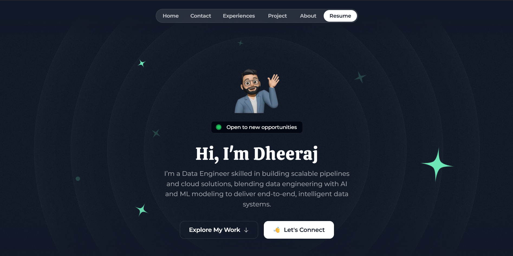
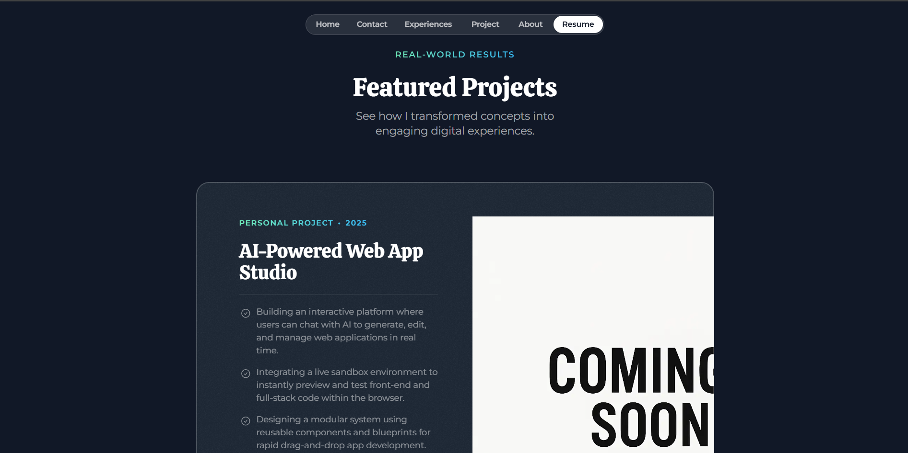
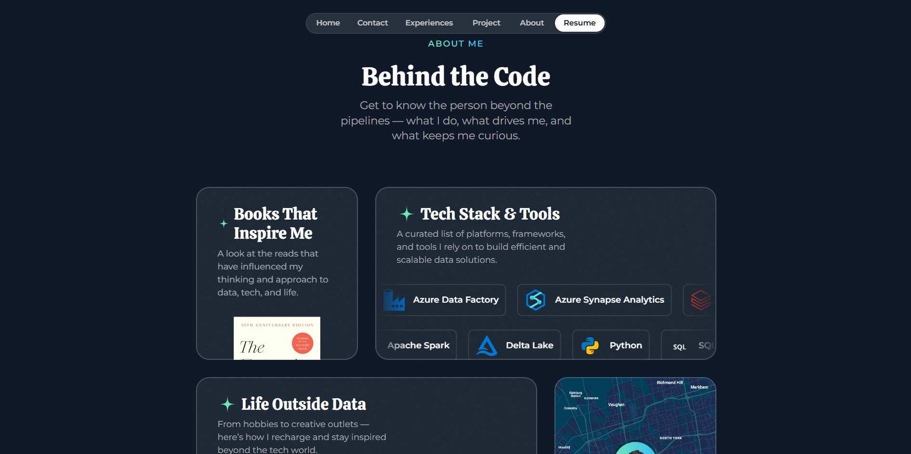

# Dheeraj K Portfolio

Personal site for sharing my data engineering profile, current projects, and a contact channel backed by Neon Postgres. The UI is built with Next.js (App Router) and Tailwind CSS.

## Portfolio Preview

| Hero | Projects | Contact |
| --- | --- | --- |
|  |  |  |

## Features
- Dynamic homepage sections (hero, experience timeline, testimonials, toolbox)
- Contact modal that persists inquiries to Neon PostgreSQL via Prisma
- Privacy and Terms pages tailored for this portfolio
- Responsive, dark-themed layout with custom hero animation effects
- Blog/newsletter hooks stubbed out until content is ready (easy to re-enable later)

## Architecture
- **Frontend**: Next.js 14, React 18, TypeScript
- **Styling**: Tailwind CSS + bespoke utilities (hero orbit animation, badges)
- **Data Layer**: Prisma Client talking to Neon PostgreSQL (contact data only)
- **Hosting Target**: Vercel (serverless) with optional self-hosting for experimentation
- **Assets**: Local SVG icon set, hero imagery under `src/assets`

## Getting Started
```bash
# install dependencies
cd next-app
npm install

# generate prisma client
npx prisma generate

# start development server
npm run dev
```
Your app will be available at http://localhost:3000.

## Project Structure
```text
next-app/
  prisma/
    migrations/               # Prisma migrations (ContactMessage table)
    schema.prisma             # Prisma models (contacts only)
  public/
    icon.svg                  # Favicon (replace with your branding)
    resume.pdf                # Resume served from /resume.pdf
  src/
    app/                      # App Router pages (home, privacy, terms, 404, OG)
    assets/                   # Images and SVG icons
    components/               # Reusable React components (home sections, UI)
    db/                       # Prisma client wrapper
    lib/                      # Feature flags & utilities
    static/home/              # Portfolio content (hero, projects, testimonials, etc.)
pictures/                     # README preview images
README.md                      # This documentation
```

## Configuration
Create `next-app/.env` based on the following template:
```env
DATABASE_URL="postgresql://<neon-connection-string>"
PRISMA_SCHEMA="public"
NEXT_PUBLIC_API_URL="http://localhost:3000/api"
NEXT_PUBLIC_SITE_URL="http://localhost:3000"
```
These same variables must be added to your production environment (e.g., Vercel project settings).

## Database Setup
Apply the Prisma migration to ensure the contact table exists:
```bash
cd next-app
npx prisma migrate deploy
```
You can verify the data using Prisma Studio:
```bash
npx prisma studio
```

### Table Schema
`ContactMessage` (schema: `public`)
| Column    | Type        | Constraints              |
|----------|-------------|--------------------------|
| id        | SERIAL      | Primary key              |
| name      | TEXT        | Not null                 |
| email     | TEXT        | Not null                 |
| message   | TEXT        | Not null                 |
| createdAt | TIMESTAMP   | Default `now()`          |

## Customization
Update the portfolio copy under `next-app/src/static/home/`:
- `0-siteConfig.ts` � name, tagline, social links, keywords
- `3-experiences.ts` � professional timeline entries
- `5-portfolioProjects.ts` � project cards (placeholder project included)
- `6-testimonials.ts` � testimonials
- `7-about.ts` � hobbies, map, toolkit cards
- `8-bookDetails.ts` � currently shows a "reading list coming soon" placeholder
- `9-toolBoxDetails.ts` � toolbox categories and icons

Swap hero imagery, favicon, and resume under `next-app/public/` and `next-app/src/assets/images/` as needed.

## Deployment Options
- **GitHub Actions (Optional)**: Configure repository secrets `VERCEL_TOKEN`, `VERCEL_ORG_ID`, and `VERCEL_PROJECT_ID` to enable the included `.github/workflows/deploy.yml` pipeline.
- **Vercel (Recommended)**: Serverless deployment with built-in Next.js support. Add environment variables, push `main`, and set `LINKS.Website` once the final domain is chosen.
- **Custom Hosting (Optional)**: The `next.config.mjs` output is `standalone`; you can containerize the `next-app` build or run `npm run build && npm run start` on your own VM.

## Deployment Commands
```bash
# build the production bundle
npm run build

# apply migrations against production
npx prisma migrate deploy

# start standalone server (if self-hosting)
npm run start
```
*(Use `npm` or `pnpm` equivalents if you prefer those package managers.)*

## Future Roadmap
- Add a lightweight Docker setup for local containerized development (Next.js + Neon)
- Replace `comingSoon.png` once the AI Web App Builder demo is live
- Publish initial blog posts and re-enable newsletter, RSS, and view tracking
- Hook contact submissions into email or Slack notifications
- Add analytics (PostHog, Plausible, or Vercel Web Analytics) once traffic grows

## License
MIT License � you are free to reuse components; please provide attribution if it helps you.

## Contact
Questions, collaboration ideas, or feedback? Reach out via the contact form or email 
Email: `dheeraj1208.k@gmail.com`.
Website: `https://dheerajk-portfolio.vercel.app/`

